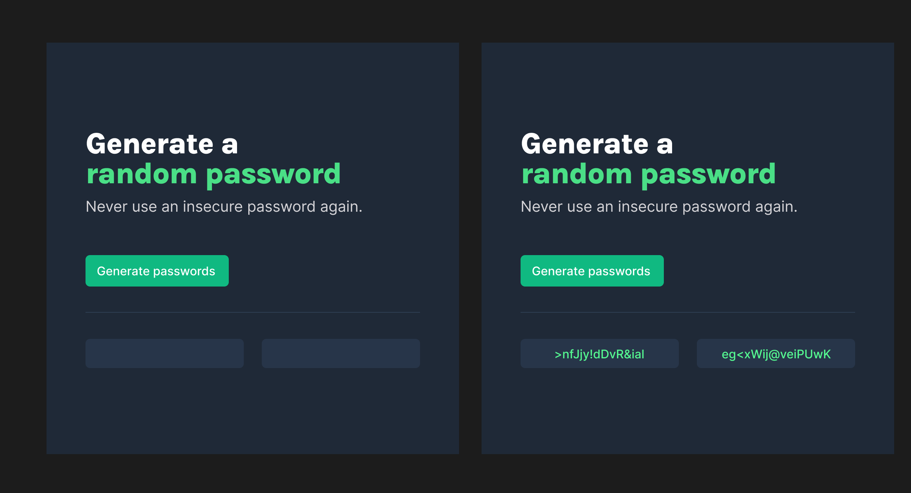
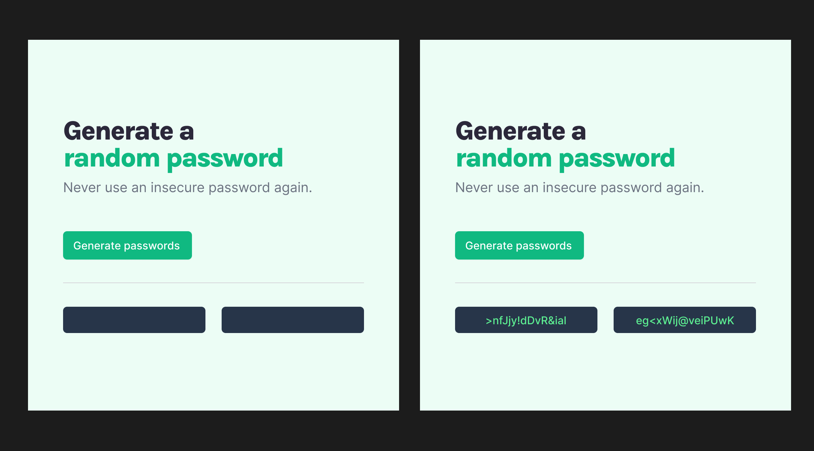
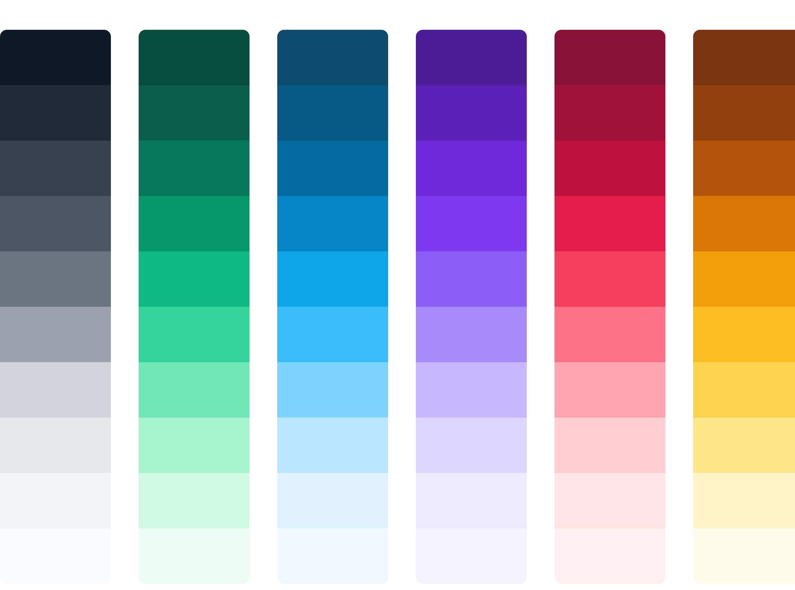

# SCRIMBA PASSWORD GENERATOR SOLO PROJECT

## How it Works
A simple webpage which generate random password on user click. Password should be 15 characters long and copy to the clipboard when user click on generated password.

#### Bonus (If you can do)

- User can choose if he/she prefer special character and numbers in password or not.
- User can change the length of password.


## Design


### Dark theme



### Light Theme




<h2 style="color: #047857;">Color Palettes used in Design</h2>





## Characters to use in password


```js
const characters = ["A","B","C","D","E","F","G","H","I","J","K","L","M","N","O","P","Q","R","S","T","U","V","W","X","Y","Z","a","b","c","d","e","f","g","h","i","j","k","l","m","n","o","p","q","r","s","t","u","v","w","x","y","z", "0", "1", "2", "3", "4", "5", "6", "7", "8", "9","~","`","!","@","#","$","%","^","&","*","(",")","_","-","+","=","{","[","}","]",",","|",":",";","<",">",".","?","/"];
```
